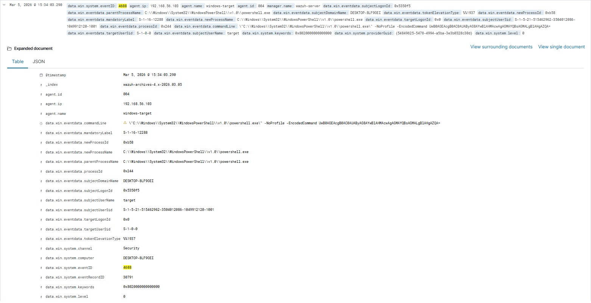
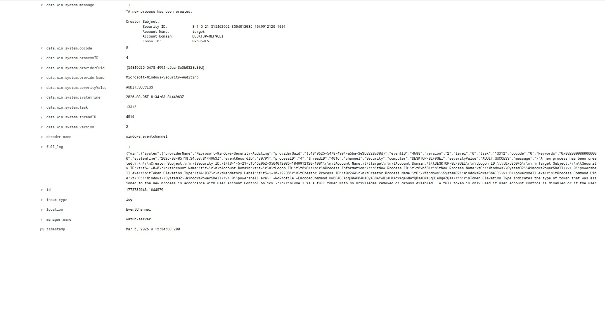
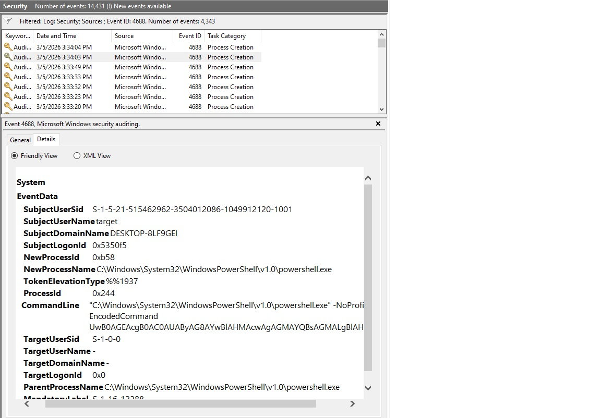

> 🔙 [Back to SOC Portfolio](../README.md)

---

# Detecting Suspicious PowerShell Execution — Encoded Command

> **Lab Type:** Threat Detection | **Platform:** Wazuh SIEM | **Difficulty:** Intermediate

---

## Objective

This lab demonstrates how a **Security Operations Center (SOC)** can detect suspicious PowerShell activity leveraging Base64-encoded commands — a common attacker technique used to obfuscate malicious payloads and evade security controls.

We simulate a real-world attack scenario where a threat actor executes an encoded PowerShell command on a Windows target, and show how **Wazuh** detects the activity through **Windows Security Event Logs**.

---

## Lab Architecture
```
┌─────────────────┐        ┌──────────────────┐        ┌─────────────────────┐
│   Kali Linux    │ ──────▶│   Windows 10     │ ──────▶│    Wazuh SIEM       │
│   (Attacker)    │  RDP/  │   (Target)       │  Agent │  (Detection & Alert)│
│                 │  Shell │  Wazuh Agent     │  Logs  │                     │
└─────────────────┘        └──────────────────┘        └─────────────────────┘
```

| Component     | Role              | OS / Tool         |
|---------------|-------------------|-------------------|
| Attacker      | Executes payload  | Kali Linux        |
| Target        | Victim machine    | Windows 10        |
| SIEM          | Detection engine  | Wazuh Server      |

---

## Attack Simulation

The attacker uses the `-EncodedCommand` flag to pass a **Base64-encoded payload** to PowerShell, a well-known Living-off-the-Land (LotL) technique.

**Command executed on the target:**
```powershell
powershell.exe -EncodedCommand <Base64EncodedPayload>
```

> For demonstration purposes, the payload executes `calc.exe` as a benign stand-in for a malicious process.

**Why attackers use encoded commands:**
- Bypass basic string-matching detection rules
- Obscure malicious intent from log reviewers
- Evade email and web gateway filters

---

## Detection — Wazuh Alert

Wazuh detects the activity by parsing **Windows Security Event ID 4688** (Process Creation), triggered when a new process is spawned with suspicious arguments.

### Wazuh — Expanded Document part.1


### Wazuh — Expanded Document part.2


### Alert Triggered
```
Rule ID    : [Wazuh Custom Rule]
Description: Suspicious PowerShell execution with EncodedCommand flag
Severity   : High
```

### Key Fields in the Alert

| Field             | Value                                  |
|-------------------|----------------------------------------|
| Event ID          | `4688` — Process Creation              |
| Parent Process    | `powershell.exe`                       |
| New Process       | `C:\Windows\System32\calc.exe`         |
| Command Flag      | `-EncodedCommand`                      |

---

## Log Analysis

During investigation, the SOC analyst reviews the raw Windows Security logs to confirm the chain of execution.

### Windows Event Viewer — Event ID 4688


```
Parent Process : powershell.exe
Child Process  : C:\Windows\System32\calc.exe
Command Line   : powershell.exe -EncodedCommand <Base64String>
```

> **Analyst Note:** PowerShell spawning child processes via encoded commands is a **high-confidence indicator** of post-exploitation or malware staging activity.

---

## Investigation Steps

A SOC analyst responding to this alert should follow these steps:

1. **Identify the user account** that executed the PowerShell command
2. **Verify the source host** and IP address
3. **Decode and review** the Base64-encoded command
4. **Map child processes** spawned by PowerShell in that session
5. **Correlate events** with other suspicious activity in the same timeframe
6. **Check for persistence** mechanisms (scheduled tasks, registry run keys)

---

## MITRE ATT&CK Mapping

| Field       | Value                                              |
|-------------|----------------------------------------------------|
| Tactic      | **Execution**                                      |
| Technique   | **T1059.001** — Command and Scripting: PowerShell  |
| Sub-technique | Obfuscated Command Execution via `-EncodedCommand` |

🔗 [View T1059.001 on MITRE ATT&CK](https://attack.mitre.org/techniques/T1059/001/)

---

## Response Actions

Upon confirming malicious activity, the following response actions are recommended:

- **Isolate** the affected host from the network immediately
- **Review** full PowerShell command history (`PSReadLine`, Script Block Logging)
- **Hunt** for persistence mechanisms on the host
- **Reset** credentials for the compromised user account
- **Run** a full malware scan and check for lateral movement indicators

---

## Lessons Learned

- Encoded PowerShell commands are a **staple of modern attacker tradecraft**, used in everything from commodity malware to APT campaigns.
- **Process creation logging (Event ID 4688)** combined with **PowerShell Script Block Logging** provides high-visibility coverage for this technique.
- Wazuh's rule engine can effectively detect these patterns with properly configured Windows audit policies.
- Early detection of encoded PowerShell execution can **prevent full compromise** by catching attackers during the execution phase — before persistence is established.

---

## Tools & Technologies


---

*Lab developed as part of a SOC Analyst portfolio. For educational purposes only.*
